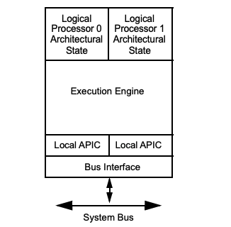

---
aliases:
- HTT
- Hyper-threading Technology
author: Maneesh Sutar
date: 2024-01-03
tags:
- public
title: Intel x86-64 Architecture
---

# Intel x86-64 Architecture

## Intel® Hyper-threading technology

**Hyper-threading** is intel's proprietary implementation of [Simultaneous multithreading (SMT)](simultaneous_multi_threading.md)  
It enables hardware level concurrent processing inside a physical CPU core.

For example, the [i7-9750H CPU](https://ark.intel.com/content/www/us/en/ark/products/191045/intel-core-i7-9750h-processor-12m-cache-up-to-4-50-ghz.html), is taking up single socket in the motherboard.  
Inside the CPU, there are 6 physical cores, which use intel's [multi-core architecture](#multi-core-architecture) to support concurrent processing of OS threads.  
Inside a physical core, if HYPER-THREADING is enabled (which is yes in above case), we can get 2 logical processors ("Threads per core" in above image) inside a physical core.

Because of HYPER_THREADING, when we run `htop` command, we can see see 12 individual compute units instead of 6

### How does it look internally?

Each logical processor inside a physical core has its own **Architectural State**. The state contains **registers**. Some of them are duplicated for each processor (general purpose, xmm / ymm / zmm, segment registers), some are shared (Memory type range registers (MTRRs)), while some are shared or duplicated based on implementation.

Each logical processor has its own **APIC ID**, which enables OS to treat every logical processor as a seperate execution unit.

The core of the physical processor, i.e.  execution unit AND the system bus is shared between logical processors  
==CPU cache is shared==

## Multi-core Architecture

In this, each processor core has dedicated microarchitectural resources identical to a single-processor implementation of the underlying microarchitecture without hardware multi-threading capability.

In Intel, each logical processor inside a dual-core processor (whether supporting Intel Hyper-Threading Technology or not) has its own APIC functionality, PAT, machine check architecture, debug registers and extensions.

Each logical processor handles serialization instructions or self-modifying code on its own. Memory order is handled the same way as in Intel Hyper-Threading Technology  
The topology of the cache hierarchy (with respect to whether a given cache level is shared by one or more processor cores or by all logical processors in the physical package) depends on the processor implementation.

## SIMD Support

Each logical processor has its own set of 8 / 16 SIMD registers

## References

1. Intel Architecture Developer's Manual, volume 1 and volume 3A
1. <https://en.wikipedia.org/wiki/Hyper-threading>
