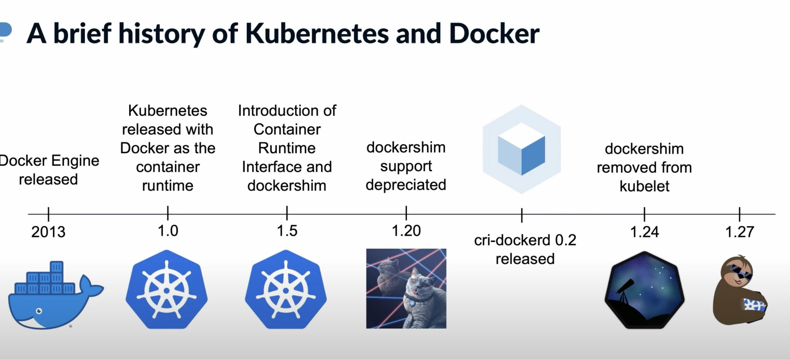
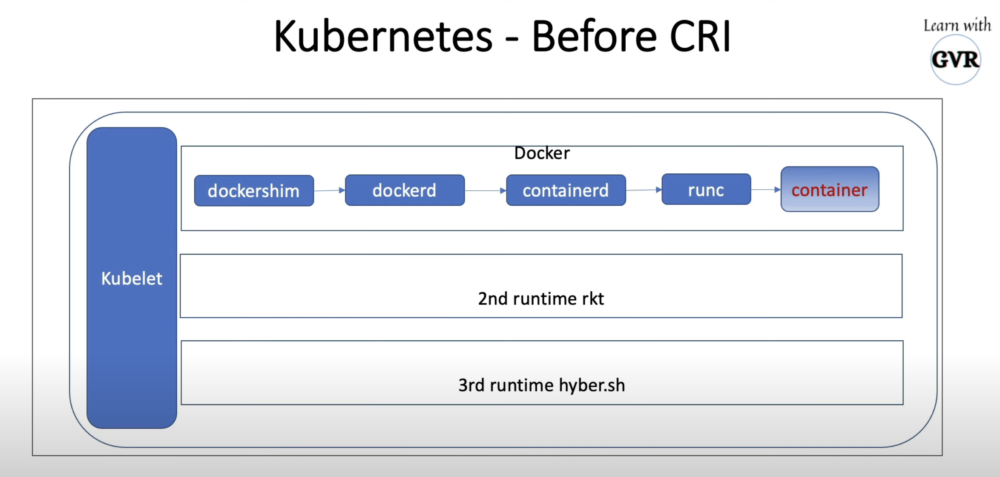

# Kubernetes

## CRI

Container Runtime Interface  
<https://github.com/kubernetes/cri-api>

Why CRI? <https://github.com/kubernetes/community/blob/master/contributors/devel/sig-node/container-runtime-interface.md>

 a plugin interface which enables the kubelet to use a wide variety of container runtimes, without having a need to recompile the cluster components.

### the old way: dockershim

References:  
<https://kubernetes.io/blog/2020/12/02/dont-panic-kubernetes-and-docker/>  
<https://kubernetes.io/blog/2020/12/02/dockershim-faq/>  
<https://kubernetes.io/blog/2022/02/17/dockershim-faq/>

History: <https://kubernetes.io/blog/2022/05/03/dockershim-historical-context/>  
Brief history:  
  
Image [ref](https://youtu.be/2PvzB9st15Q?t=272)

Note: #tofix  remove "dockershim" from following image, as dockershim was added as a compatability layer between the CRI and dockerd.  

Image [ref](https://youtu.be/0sca08LRigE?t=187)

  
Image [ref](https://kubernetes.io/blog/2018/05/24/kubernetes-containerd-integration-goes-ga/)

Early versions of Kubernetes only worked with a specific container runtime: **Docker Engine**. Later, Kubernetes added support for working with other container runtimes. The CRI standard was [created](https://kubernetes.io/blog/2016/12/container-runtime-interface-cri-in-kubernetes/) to enable interoperability between orchestrators (like Kubernetes) and many different container runtimes (crun, rkt, hypernetes).

Docker Engine doesn't implement that interface (CRI). To solve this, a small software shim (dockershim) was introduced as part of the kubelet component specifically to fill in the gaps between Docker Engine and CRI. But dockershim was never intended to be a permanent solution, and over the course of years, its existence has introduced a lot of unnecessary complexity to the kubelet itself.

So dockershim was deprecated in k8s v1.20, and completely removed in v1.24.

You see, the thing we call “Docker” isn’t actually one thing—it’s an entire tech stack, and one part of it is a thing called “containerd,” which is a high-level container runtime by itself  
Docker is cool and useful because it has a lot of UX enhancements that make it really easy for humans to interact with while we’re doing development work, but those UX enhancements aren’t necessary for Kubernetes, because it isn’t a human.  
Docker isn’t compliant with CRI, the [Container Runtime Interface](https://kubernetes.io/blog/2016/12/container-runtime-interface-cri-in-kubernetes/). If it were, we wouldn’t need the shim, and this wouldn’t be a thing

### the replacement: cri

The first release article (2016, k8s 1.5): <https://kubernetes.io/blog/2016/12/container-runtime-interface-cri-in-kubernetes/>  
Not so updated readme file in k8s: <https://github.com/kubernetes/community/blob/master/contributors/devel/sig-node/container-runtime-interface.md>

Kubelet always uses CRI except for using the rktnetes integration.  
The old, pre-CRI Docker integration was removed in 1.7.

Widely used CRIs:

* containerd's [cri plugin](containerd.md#cri) (CNCF graduated)
* [cri-o](cri-o.md) (CNCF graduated)
* [cri-docker](Docker.md#cri-docker)

Deprecated CRI:

* [rktlet](https://github.com/kubernetes-retired/rktlet) - a CRI for [rkt (EOL)](https://github.com/rkt/rkt) runtime
* [frakti](https://github.com/kubernetes/frakti) - a CRI for hypervisor (VM) based containers via [runV (EOL)](https://github.com/hyperhq/runv). Replaced by [kata-containers](https://katacontainers.io/software/) project.
* [cri-containerd](https://github.com/containerd/cri) - replaced by the cri plugin inside containerd
* [singularity-cri](https://github.com/sylabs/singularity-cri)

Note: #tofix following image design is older, need to update

Running kubelet with `--container-runtime-endpoint` is now deprecated, instead one must use kubelet's `--config` option specifying the config file.  
  
Image [ref](https://youtu.be/FKoVztEQHss?t=153)

Different CRIs

### cri-tools

[cri-tools](https://github.com/kubernetes-sigs/cri-tools) provide CLI and validation tools for Kubelet Container Runtime Interface (CRI) .

`crictl` is a command-line interface for CRI-compatible container runtimes.  
Supported comamands: `images, ps`  
See the [documentation](https://github.com/kubernetes-sigs/cri-tools/blob/master/docs/crictl.md)

## Kubectl

A cli tool to play with k8s cluster, similar to docker-cli

### Kubectl context

similar to [docker context](Docker.md), kubectl also has its context  
dependeing on which context is selected, kubectl can toggle between multiple k8s clusters

to see all contexts in kubectl, run `kubectl config get-contexts`  
to see name of the active context, run `kubectl config current-context`  
to change active context, run `kubectl config use-context`

information about all contexts is stored  in a config file (by default) located in `$HOME/.kube/config`  
with `kubectl` we can specify other config file using `--kubeconfig` flag  
or update `$KUBECONFIG` env variable with multiple config file paths (`:` seperated), to create one merged config.

To view the config, run `kubectl config view`  
see `kubectl config --help` for detailed working of how config is generated

## references

Good refs on k8s, dockershim, cri
